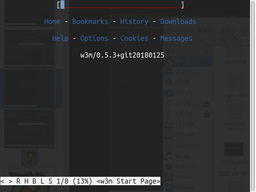
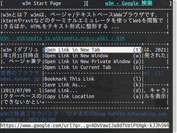

<!-- Document: readme.md

	w3mplus のマニュアル

	Metadata:

		id - 7539cc1d-6b5f-44e5-baf7-a66b22b2213f
		author - <qq542vev at https://purl.org/meta/me/>
		version - 0.4.0
		date - 2022-09-17
		since - 2019-12-26
		copyright - Copyright (C) 2019-2022 qq542vev. Some rights reserved.
		license - <CC-BY at https://creativecommons.org/licenses/by/4.0/>
		package - w3mplus

	See Also:

		* <Project homepage at https://github.com/qq542vev/w3mplus>
		* <Bag report at https://github.com/qq542vev/w3mplus>
-->

# w3mplus

 

w3mplus はテキストブラウザー [w3m](https://github.com/tats/w3m "GitHub - tats/w3m: Debian's w3m: WWW browsable pager") の拡張機能です。[Pale Moon](https://www.palemoon.org/ "The Pale Moon Project homepage") + [Pentadactyl](https://github.com/pentadactyl/pentadactyl "GitHub - pentadactyl/pentadactyl: Pentadactyl for Pale Moon (community maintained)") + [Vim](https://www.vim.org/ "welcome home : vim online") の機能を模倣し、w3m 上で可能な限り再現することを目的としています。また [Mozilla Firefox](https://www.mozilla.org/firefox/new/) と [Vimperator](http://vimperator.org/ "Vimperator // Projects") の情報も参考にしています。主に以下のような機能を利用できます。

 * Pale Moon の模倣
   * メニューバー
   * ロケーションバー
   * コンテキストメニュー
   * Denylist
   * その他の細かな UI 関連
 * Pentadactyl の模倣
   * `o`, `t`, `O`, `T`, `gh`, `gu` などのリソースへのアクセス
   * `h`, `j`, `k`, `l`, `gg`, `G`, `0`, `$` などのページ内の移動
   * `y`, `Y` などのヤンク
   * `d`, `u` などのタブを閉じる、タブの復元
   * ヒント及び拡張ヒント
   * クイックマーク、ローカルマーク、URL マーク
   * レジスタ

可能な限り w3m 固有の機能を使用していますが、一部の再現が難しい機能は w3m の Local CGI 機能を使用しています。Local CGI はほぼ全て [POSIX コマンド](https://pubs.opengroup.org/onlinepubs/9699919799/idx/utilities.html "Utilities") による Shell Script で作成されており、それらは [POSIX 環境](https://pubs.opengroup.org/onlinepubs/9699919799/)に準拠しています。

Debian GNU/Linux 10.13, w3m 0.5.3-37, dash 0.5.10.2-5, gawk 1:4.2.1+dfsg-1 の環境で動作確認しています。

# インストール

w3mplus の全ての機能を利用するためには w3m がインストールされ、POSIX に準拠した環境が必要です。POSIX に完全に準拠した環境でなくとも、w3m の Local CGI を使用しない機能はそのまま利用できます。

`sh` コマンドと `awk` コマンドは POSIX 環境に高度に準拠したものを利用することお勧めします。例えば、[mawk](https://invisible-island.net/mawk/) は拡張正規表現を完全に実装していない、正規表現の長さに制限があるなどの理由で現状では利用できません。よって [Gawk](https://www.gnu.org/software/gawk/) の利用をお勧めします。

[Releases ページ](https://github.com/qq542vev/w3mplus/releases)から最新バージョンをダウンロードして、それを解凍します。解凍したディレクトリに移動し、`release/install.sh` を実行すればインストールは完了です。

# 使い方

インストール後の `~/.w3mplus/doc/index.html` にマニュアルがあります。また Web 上でも[マニュアル](https://qq542vev.github.io/w3mplus/documents/)を公開しています。
